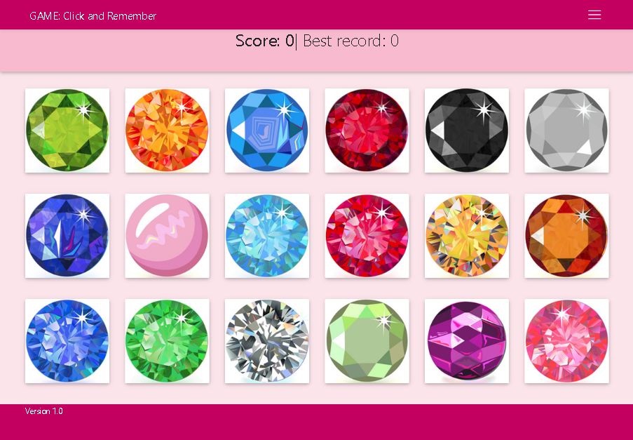
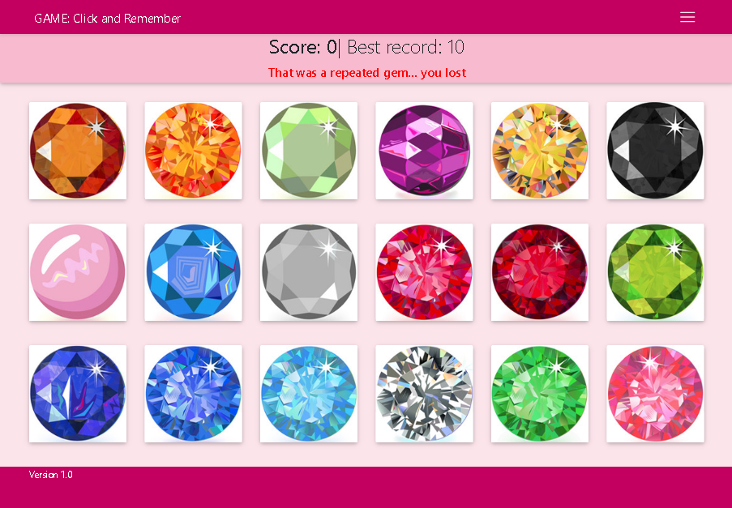
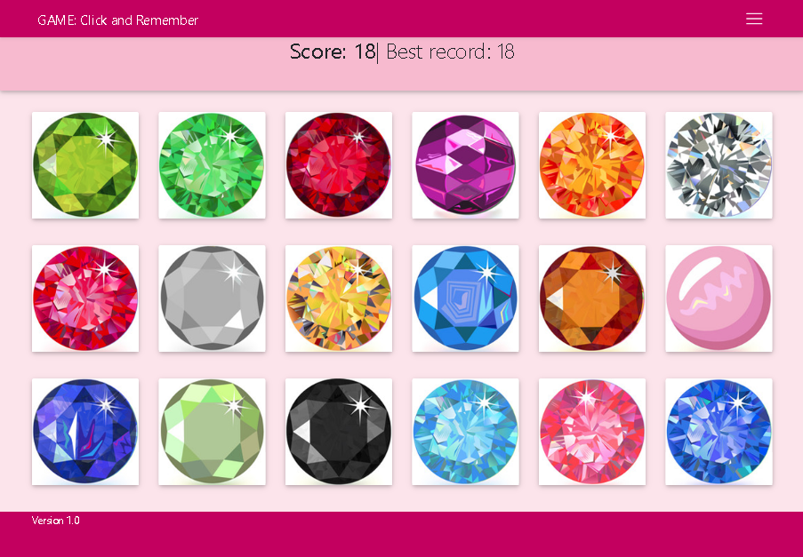

# GAME: Click and Remember

> **Cretaed by:**     [Juan I Diaz](http://www.idiaz.ca/) (jdi@idiaz.ca)

> **Date:**           April 2019

## DESCRIPTION
This project is a memory game where the user have to click on 18 images of gems. The images are arranged in three rows of six. Every time the user clicks on a gem, the location of the images is shuffled, then the user needs to clik on a gem that has not been clicked on before. If th euser clicks on a diferent gem, the images will shuffle again and the gmae will continue. If the user clocks on a previously clicked image, the game is over. The score and maximum recors is kept per browser session.

This project uses React to handle the components of the game.

## INSTRUCTIONS
1. Click on a gem's image. Make sure you keep track of which image have you clicked!
2. Once the image was clicked in the previous step the images will shuffle randomly. Now click a DIFFERENT image that has not been previously clicked on.
3. If the image clicked hasn't been clicked on before, the score will tally up and another image needs to be clicked following steps 1 and 2.
4. However, if you clicked on an image twice, you lost the game. Your score will be set to 0 and a new game has started.

**NOTE:** The maximum score possible is 18!

## SCREENSHOTS
`Game first loaded`

`After loosing the game`

`Maximum score: 18`

## BUILDING TOOLS
- FRONT END
    - HTML, CSS
    - Javascript and jQuery
    - Bootstrap and MDBootstrap
    - React

## QUESTIONS OR COMMENTS
- Feel free to contact the developer @ <jdi@idiaz.ca>!
- See the project [live](#).